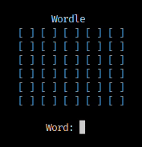

# Mini Wordle

Wordle is a game created and developed by Welsh software engineer Josh Wardle.
The game consists in 6 chances to guess a 5-letter word. 
This is a minimalistic version of the game that you can play on your terminal.

<div align="center">
    
<div>

## How To Run
```
gcc wordle.c -o wordle && ./worldle 
```
<div align="center">
    
<div>


